# Real-time 'me-not_me' Face Detector

In this tutorial, I will show you how to write a real-time face detector using Python, TensorFlow/Keras and OpenCV.

| 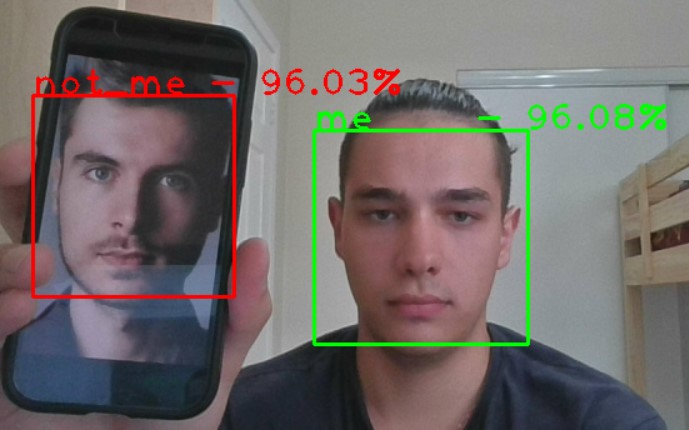 |
|:--:|
| <b>Real-time 'me-not_me' Face Detector</b>|

All code is available in [this repo](https://gitlab.com/Winston-90/me_not_me_detector/).

First, in **Theoretical Part** I will tell you a little about the concepts that will be useful for us (*Transfer Learning* and *Data Augmentation*), and then I will go to the code analysis in the **Practical Part** section.

Note, that you must have *tensorflow* and *opencv* libraries installed to run this code. You can do it manually or simply run `pip install -r requirements.txt` command after you have repo downloaded. You can also do it with conda commands `conda install -c conda-forge numpy, opencv, tensorflow`.

## Problem Statement

Here I want to build a face detector that also can distinguish me from other people. You can see the results of my work at the end of this article.

The initial task can be divided into two subtasks:
1. Train a model for face classification.
2. Adapt the model to work with a webcam as a detector.

In more detail, the task can be divided into the following stages:
1. Dataset Collection.
2. Search for a Base Model for Transfer Learning.
3. Train a Model.
4. Transform Classifier into Detector.

Before I begin to analyze these stages, I would like to very briefly outline the concepts that will be useful for us.

## Theoretical Part

At this point, I must say that this tutorial is not as detailed as it could be. For example, I will not explain what *convolution* is or why *pooling layers* are needed in CNN architecture. Of course you need to know this to understand how CNN works, but I think that this tutorial will be too cumbersome, if I explain all the concepts. On the other hand, other people have already explained many things and did it better than me. For example, [here you can read about CNN in general](https://towardsdatascience.com/a-comprehensive-guide-to-convolutional-neural-networks-the-eli5-way-3bd2b1164a53), and [here - about popular CNN architectures](https://www.jeremyjordan.me/convnet-architectures/).

### Convolutional Neural Networks

Since we are talking about image recognition, we will use *CNN - Convolutional Neural Networks*, the architecture that has achieved the greatest success in this task.

| 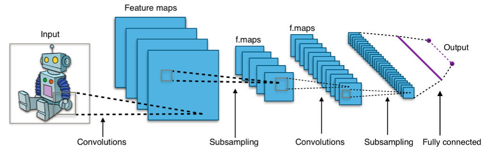 |
|:--:|
| <b>Typical Convolutional Neural Network Architecture</b>|

Unlike classical neural networks (here I mean *FDN - Feedforward Neural Network*), in CNN, neurons are: 
- firstly: arranged in the form of a tensor, not an array, 
- and secondly: they are connected only with a small number of neurons of the previous layer, so layers are NOT fully connected. 

This approach allows you to significantly reduce the number of network parameters and make the search for templates more efficient for images.

| 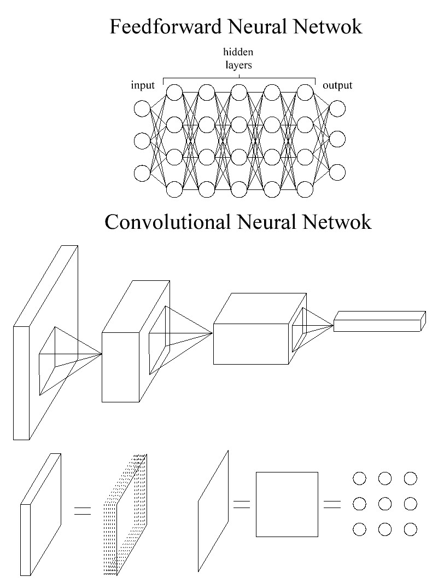 |
|:--:|
| <b>Feedforward Neural Network vs Convolutional Neural Network</b>|

At the bottom of this image, I want to explain that the layer in CNN is a *tensor* (it is often drawn as a parallelepiped). Tensor is, basically, a sequence of matrices. So each of these tensors is just a series of matrices standing on top of each other like pizza boxes. In turn, matrices are simply a sequence of neurons that are arranged in the form of a matrix, not an array, as in classic networks.

### Transfer Learning

Transfer Learning is the most important concept for this task, since it is very difficult (almost impossible) to build a face classifier from scratch. Transfer Learning is the process of using a pretrained model for your own task.

| 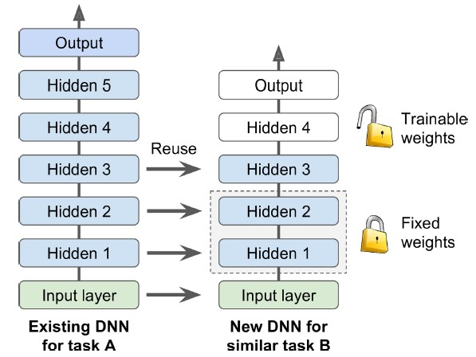 |
|:--:|
| <b>Transfer learning</b>|

This happens as follows. You find a model that is trained for a similar task (for example, recognizing 1000 classes of images, as in *ImageNet*, when you need to recognize only a few). Then you use it's weights (freeze them, which means that they will not change), and finish training the model on your small dataset. After that, you can also unfreeze all the weights and continue training the model with a very small learning rate.

This process becomes possible due to the features of the CNN architecture and the image recognition task (but also can be used with different architectures). The network learns to see patterns from layer to layer (from input to output) and they are getting more and more complicated. By the way, this explains why we are increasing the number of filters. It turns out that the general patterns for all problems are approximately the same, which allows us to use pretrained weights.

### Data Augmentation

Another important concept in the image classification problem is data augmentation. Data augmentation is the process of artificially increasing a dataset size by applying some transformations to the original images. For example, we can use horizontal and vertical reflection, small rotation or magnification, color inversion, and so on. This will significantly increase the size of the dataset and, accordingly, the generalization ability of the network.

| 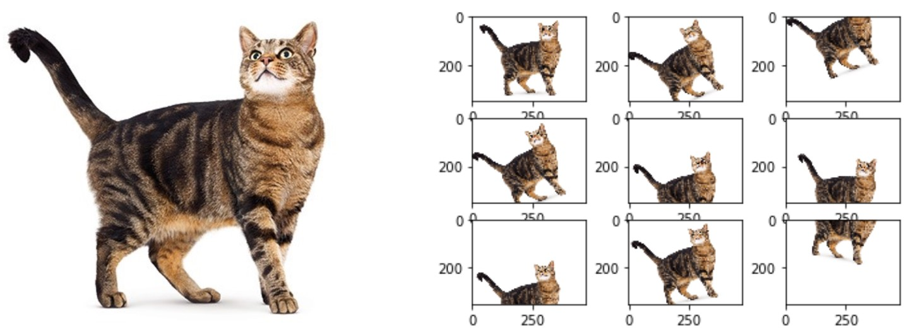 |
|:--:|
| <b>Data Augmentation. Original image (left) and augmented images (right)</b>|

The image is taken from [here](https://towardsdatascience.com/image-augmentation-for-deep-learning-histogram-equalization-a71387f609b2). In this example, when the shift values are quite high, sometimes there is a situation when only part of the image is visible. On the one hand, this is good (the network can learn to recognize a cat not by its muzzle, but by its paws and tail in the case of images where the head is not visible), but it can also confuse the network if you overdo such transformation.

There are several approaches to data augmentation in TensorFlow. We can generate images and save them to disk, or we can feed the generator directly to the network. I chose the first option, to do it more explicitly. But there are two ways here as well: generate a random number of images or generate several versions of a specific image. You can see the implementation of both options in the `data_augmentation.ipynb` notebook. I used the second option, and specifically generated five transformations for each image.

## Practical Part

### Project Structure

The project has the following structure:

```
me_not_me_detector
├───article
├───datasets
│   ├───face_dataset_test_images
│   ├───face_dataset_train_aug_images
│   └───face_dataset_train_images
├───models
│   .gitignore
│   data_augmentation.ipynb
│   me_not_me_classifier.ipynb
│   me_not_me_classifier_model_comparison.ipynb
│   me_not_me_detector.ipynb
│   README.md
└── requirements.txt
```

Let's talk about folders.
- The `article` folder contains the data for this tutorial.
- The `datasets` folder contains datasets, each of them has two classes - *me* and *not_me*. As you can see, I have a folder for test set, for initial train set and for augmented train set. To know more about the dataset see `data_augmentation.ipynb`.
- The `models` folder contains the trained models for their test and further use.

Now let's talk about the code files - jupyter notebooks. 
- `data_augmentation.ipynb` file creates an augmented dataset from an initial one and provides some information about the dataset.
- `me_not_me_classifier_model_comparison.ipynb` file contains code to train and test five different models.
- `me_not_me_classifier.ipynb` file does the same thing, but for one particular model. You can use it as an example to build your own classifier.
- `me_not_me_detector.ipynb` file uses the OpenCV library and turns the classifier into a real-time detector.

Other files are used as additional files: 
- `.gitignore` contains files that will not be pushed in git, 
- `requirements.txt` contains the list of libraries that have to be installed to run this code etc.

### 1. Dataset Collection

First of all, we need to collect a dataset. I used my photos and photos of my family to train the model, but you can also train the model on [some other face datasets](https://analyticsindiamag.com/10-face-datasets-to-start-facial-recognition-projects/). I used only personal photos to check whether such a small dataset is enough for the model to show acceptable quality.

I cropped the face from each photo, and resized them to the size of 250x250 (which you don't have to do, since TensorFlow can do it for you). Here are some examples of photos from initial dataset:

| 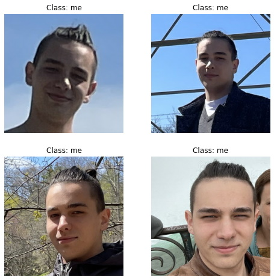 |
|:--:|
| <b>Initial dataset photos</b>|

In total, I collected 215 photos, where 82 are *me* and 133 are *not_me*.

For the test set, I immediately put aside 20 photos. This can be done automatically, but I did it manually, because the dataset is too small. For the train set I applied my data augmentation code from `data_augmentation.ipynb` notebook. Thus, the dataset increased five times! (five photos were generated for each photo). Here is an example of the generated photos:

| 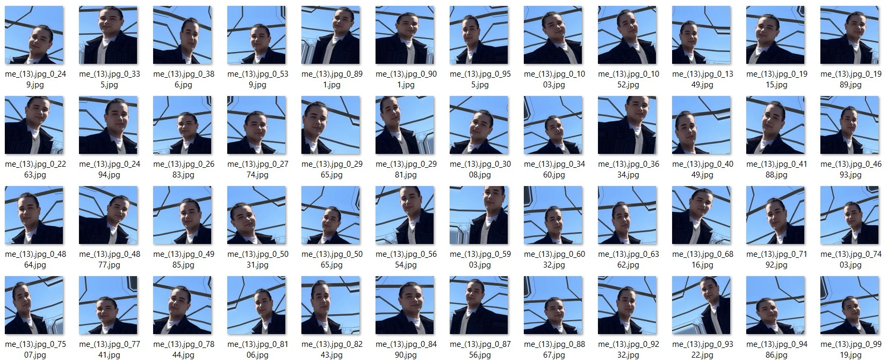 |
|:--:|
| <b>Augmented photos</b>|

When the dataset is ready, we can start training the model.

### 2. Search for a Base Model for Transfer Learnings

There is nothing complicated here - I just used different models that are trained on *ImageNet* dataset. If they don't have a good accuracy, then I think I will use something like VGGFace models like [here](https://machinelearningmastery.com/how-to-perform-face-recognition-with-vggface2-convolutional-neural-network-in-keras/). But the quality I got is good enough. We can load pretrained keras model with this code:

```python
from tensorflow import keras
img_height, img_width = 250, 250  # size of images

base_model = keras.applications.ResNet50(weights='imagenet', 
                                         include_top = False, # without dense part of the network
                                         input_shape = (img_height, img_width, 3))
```

### 3. Train a Model

Now we have to freeze these weights, add some layers on top of the model and train the model on our little dataset.

As I said earlier, `me_not_me_classifier_model_comparison.ipynb` file contains the code for different models. You can use it to do your own experiment. Code examples below are taken from `me_not_me_classifier.ipynb`. We will use *ResNet50* as the initial model here.

After import libraries and dataset loading we load pretrained model exactly as in the code above. After that we need to restore the top of the model - the dense part. Note, that this part is different for different models. To know what layers do you need, you can load model with top and without top, call `model.summary()` method and see, how do they differ:  

```python
from tensorflow import keras

model_without_top = keras.applications.ResNet50(weights='imagenet',
                                                include_top=False,  # without dense part of the network
                                                input_shape=(img_height, img_width, 3))

model_with_top = keras.applications.ResNet50(weights='imagenet',
                                             include_top=True,  # with dense part of the network
                                             input_shape=(224, 224, 3))

model_without_top.summary()
model_with_top.summary()
```

To add layers I use *TensoFlow Functional API*. Of course, you need some knowledge about TensorFlow and CNN, but you also can try to add different layers and get non-original architecture. In my case we need a global average pooling layer and dense layer. Don't forget to freeze other weights beforehand.

```python
from tensorflow import keras

# Set layers to non-trainable
for layer in base_model.layers:
    layer.trainable = False

# Add custom layers on top of ResNet
global_avg_pooling = keras.layers.GlobalAveragePooling2D()(base_model.output)
output = keras.layers.Dense(num_classes, activation='sigmoid')(global_avg_pooling)

face_classifier = keras.models.Model(inputs=base_model.input,
                                     outputs=output,
                                     name='ResNet50')
```

After that, we continue to configure the model. I added a *ModelCheckpoint* object to save the model on the disk if something goes wrong and also *EarlyStopping* as a regularization technique. As an optimization method, I used Adam with a standard learning rate value. I also tried using various *scheduling techniques*, but they did not bring much result.

```python
from tensorflow.keras.callbacks import ModelCheckpoint
from tensorflow.keras.callbacks import EarlyStopping

# ModelCheckpoint to save model in case of interrupting the learning process
checkpoint = ModelCheckpoint("models/face_classifier.h5",
                             monitor="val_loss",
                             mode="min",
                             save_best_only=True,
                             verbose=1)

# EarlyStopping to find best model with a large number of epochs
earlystop = EarlyStopping(monitor='val_loss',
                          restore_best_weights=True,
                          patience=3,  # number of epochs with no improvement after which training will be stopped
                          verbose=1)

callbacks = [earlystop, checkpoint]

face_classifier.compile(loss='categorical_crossentropy',
                        optimizer=keras.optimizers.Adam(learning_rate=0.01),
                        metrics=['accuracy'])
```

So now we can start the training process. After it's over you will have a ready-to-use model. You can check it's functionality with the *Testing* section code in `me_not_me_classifier.ipynb` file.


```python
epochs = 50

history = face_classifier.fit(
    train_ds,
    epochs=epochs,
    callbacks=callbacks,
    validation_data=val_ds)

face_classifier.save("models/face_classifier.h5")
```

### 4. Transform Classifier into Detector

Now we have to use *OpenCV* library for web camera access and face detection.

Frankly speaking, the phrase "transform classifier into detector" is incorrect because of the definitions of the classifier and detector. 
A classifier (understood as an image classifier) is a model that receives an image as an input, and at the output gives a label of one of the possible classes (in our case, *me* or *not_me*). 
A detector (understood as a face detector) is a model that receives an image as an input, and outputs the coordinates of the bounding box around faces, if there are faces in this picture.

I use this phrase to show that the final program (which continues to be a classifier) now also gives out exactly where the face is in the picture. In addition, now it can work correctly in the case when there are several faces in the photo at once.

Training a face detector is a very difficult task (mainly due to the fact that the data is difficult to label), so I will use the face detector provided by OpenCV. It is very simple to use. In the code below, the `faces` variable is an array of all the faces in the image. For each face, there are four values for bounding box:
- x - x coordinate of the upper-left corner, 
- y - y coordinate of the upper-left corner, 
- w - width of the bounding box, 
- h - height of the bounding box. 
The following code highlights your face in the webcam image in real-time, as shown in the image below.

```python
import cv2 # OpenCV

# opencv object that will detect faces for us
face_cascade = cv2.CascadeClassifier(cv2.data.haarcascades + 'haarcascade_frontalface_default.xml')
video_capture = cv2.VideoCapture(0)  # webcamera

if not video_capture.isOpened():
    print("Unable to access the camera")
else:
    print("Access to the camera was successfully obtained")

print("Streaming started")
while True:
    # Capture frame-by-frame
    ret, frame = video_capture.read()
    if not ret:
        print("Can't receive frame (stream end?). Exiting ...")
        break

    gray = cv2.cvtColor(frame, cv2.COLOR_BGR2GRAY)

    faces = face_cascade.detectMultiScale(
        gray,
        scaleFactor=1.3,
        minNeighbors=5,
        minSize=(100, 100),
        flags=cv2.CASCADE_SCALE_IMAGE
    )

    for (x, y, w, h) in faces:
        # for each face on the image detected by OpenCV
        # draw a rectangle around the face
        cv2.rectangle(frame, 
                      (x, y), # start_point
                      (x+w, y+h), # end_point
                      (255, 0, 0),  # color in BGR
                      2) # thickness in px
        
    # Display the resulting frame
    cv2.imshow("Face detector - to quit press ESC", frame)

    # Exit with ESC
    key = cv2.waitKey(1)
    if key % 256 == 27: # ESC code
        break
        
# When everything done, release the capture
video_capture.release()
cv2.destroyAllWindows()
print("Streaming ended")
```

| 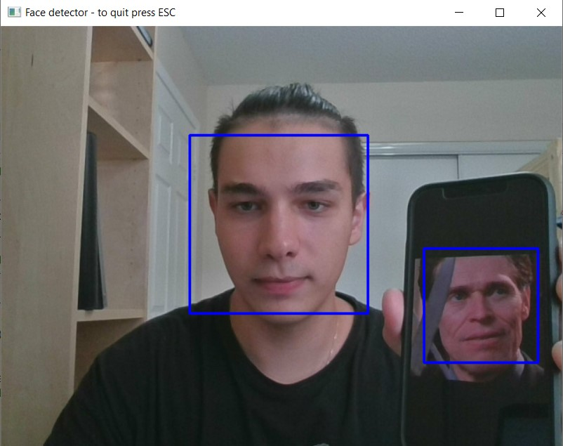 |
|:--:|
| <b>Face detection with OpenCV</b>|

Now all that remains is to load the pretrained model, pass it the fragment of the image where the face is located, and display the text on the screen! In fact, at this stage I faced a small difficulty - the model recognized me only sometimes. This happened because I trained her on images "with a margin", where not only the face was located.

I could add images with a different scale to the dataset, but I decided to do it honestly. To do this, I wrote the function `get_extended_image()`, which increases the size of the cropped image with a certain coefficient k. The larger the k, the larger the area around the face. To explain the operation of this function (or to confuse you even more), I give the following image (for simplicity, here k = 0.3, and the scale is not observed. Note, that upper left coordinate is (0, 0)). You can also see clippings of my face with different k parameters (according to the OpenCV, it uses a BGR instead of RGB, but instead of adjusting the color, let's imagine that I am an avatar). For the resulting model, I used k = 0.5.

| 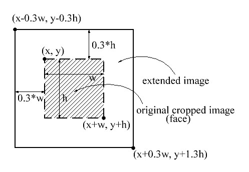 |
|:--:|
| <b>get_extended_image() function explanation</b>|

| 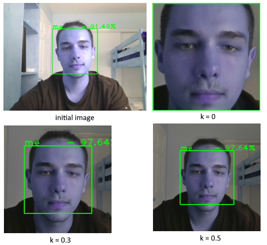 |
|:--:|
| <b>Images from get_extended_image() with different k parameter</b>|

I want to note that I used *MobileNet* as a base model. Initially, I used *ResNet50*, because it showed the best quality, but the image lagged a little, and there are no such problems with the lighter *MobileNet*. I tested all this on a computer with an i7-10750H and 32G RAM.

That's it! You can find the finished code in the `me_not_me_detector.ipynb` notebook, but note that to use it, you need to have a model in the `models` folder, otherwise you will get an error in the *load the model* cell. Here is the result. 

[](https://www.youtube.com/watch?v=MtEcbV5hdhQ)

If for some reason you can't see the video above here is the link - [Real-time 'me-not_me' Face Detector on Youtube](https://www.youtube.com/watch?v=MtEcbV5hdhQ).

I must say that although the model is quite simple, it already recognizes me well, for example if part of the face is covered. Also, I don't have a photo of Willem Dafoe in the dataset, so the model hasn't seen him before.

What about face in mask recognition - you can see that if my nose is fully covered, the program stops to recognize my face (or when it is rotated too much). But this is a problem on the detector side, because it stops transmitting the image to the model. That is because OpenCV face detectors usually don't see people in masks. But I suppose that if you can collect a large dataset, you can also teach your model to distinguish people in masks.

What surprised me - it is easier for model to recognize me when the lower part of the face is covered than the upper part. You can see that when I put on a hat or cover my forehead with my hand, the model begins to doubt. I think this is due to the fact that in all the photos I have my head is open and I have about one hairstyle.

| 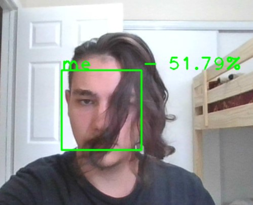 |
|:--:|
| <b>Good model!</b>|

## Conclusions

Below I present the results of training different models with or without data augmentation (x5 data augmentation in this case). The best quality (99% validation accuracy) was shown by *ResNet50*. But as I said above, I used a model based on *MobileNet*, because it showed itself well in real-time operation.

| 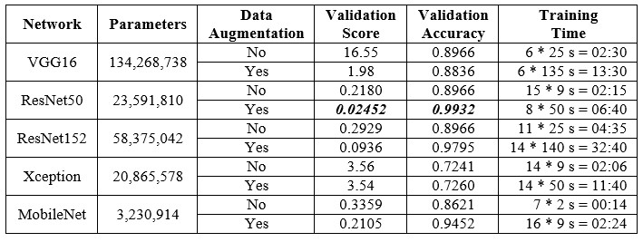 |
|:--:|
| <b>Results of training different models</b>|

These results show that data augmentation can significantly increase the quality of the model. In this case validation loss drops 10 times but this is about very little dataset. I tried to generate more images and got more accuracy. This parameter (the coefficient of the dataset increasing - so the number of augmented images generated for each image) can be chosen with *cross validation*. The best model I got among MobileNet's was one with validation loss = 0.09886 and validation accuracy = 0.9589, and coefficient of the dataset increasing = 15.

| 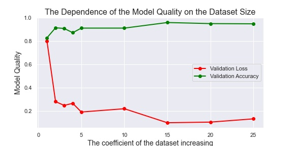 |
|:--:|
| <b>The dependence of the dataset size to model quality on the MobileNet example</b>|

At the same time the learning process became dramatically slower. It makes sense, dataset size increases and learning time increases too. You can see the plot of the dependence of the training time on the size of the dataset below - it is almost linear.

| 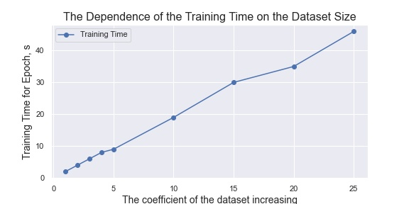 |
|:--:|
| <b>The dependence of the dataset size to learning time on the MobileNet example</b>|

The next table is the extended version of the previous. Here you can see the number of parameters, depth of the model and test accuracy. Note that layers are counted as the number of `model.layers` objects, which is not quite correct, but gives an idea of the depth of the models. Test accuracy doesn't have a lot of statistical power, because I had only 20 test images.

| 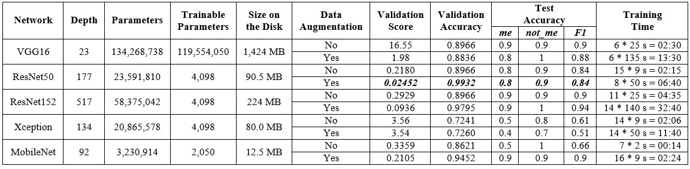 |
|:--:|
| <b>Extended results</b>|

One thing about VGG. I replaced two 4096 dense layers with two 1024 dense layers, and the model showed approximately the same result, although the number of parameters fell in three times (from 134 million to 41 million, and the trainable - from 119 million to 27 million). The size on the disk is 368 MB for this model.

From the work done, I can make the following conclusions. Some of them are more obvious, some of them are less:
- The dataset that you need to collect should be **as diverse as possible** and at the same time **as similar as possible to real data**.
- More simple models are training faster, make predictions faster and take less place on the hard disk. More simple models have fewer parameters, but, at the same time, can be deeper.
- **Transfer Learning** is a very powerful technique that allows you to solve your task even with a tiny dataset.
- **Data Augmentation** technique allows you to significantly increase the quality of your models, but it also increases training time. You can choose a data augmentation coefficient with cross validation.
- The result strongly depends on random initialization. Therefore, **even the training process with the same parameters should be run several times**. For example, in 22 minutes and 150 epochs, I got the result 0.1334 for validation loss with ResNet50 without data augmentation, which is 39% better than regular ResNet50.

Now I will say one more phrase that will confuse you even more. The convolutional part of the network (up to dense layers) transforms the original image into a point in some high-dimensional space (this is similar to the concept of *embedding*), and dense layers then build a separating hyperplane in this space.

So, it is better to build a model that will better locate these points, and then you can do with a more simple classifier. Of course, the rules by which these representations are built are very complex, which is why we need deep models with a large number of parameters.

A network that creates embeddings well can solve tasks for which it was not originally trained. So, a good model will locate all my photos close to each other (in some high-dimensional space) and all Willem Dafoe' photos close to each other. But at the same time, these two clouds of points should be located far apart. Now, when you show a network a photo of another person, it will be able to say that it is not_me, but in addition, it will be able to give out the person he most resembles or note that this person was not in the dataset. This is a variation of Metric Learning, Triplet Loss is used here.

That's it! If you have any questions or comments, I will be glad to get any feedback. Contact me via [LinkedIn](https://www.linkedin.com/in/andimid), [GitLab](https://gitlab.com/Winston-90) or email - nikolaevdmitryprog@gmail.com.